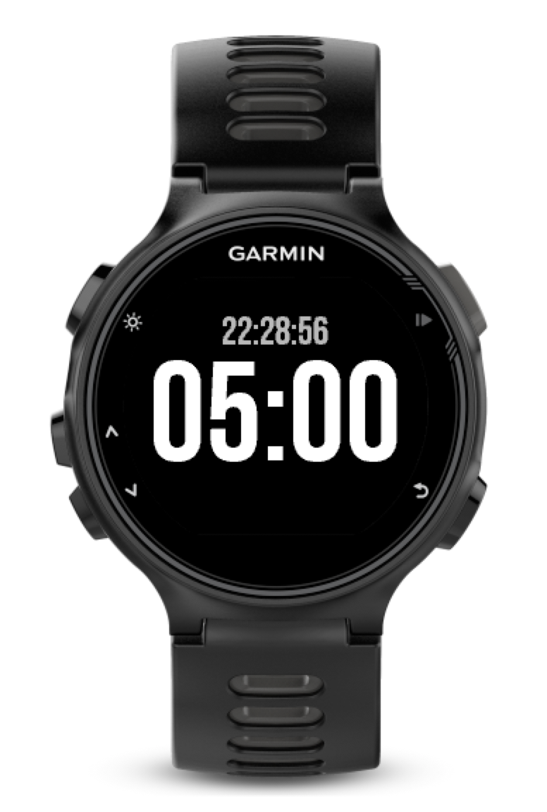

# Ticker
Garmin watch app for simple sail race timing

## Usage
While paused:

| Button | Action                         |
|--------|--------------------------------|
| Select | Start timer                    |
| Up     | Set remaning time to 5 minutes,   press again to add 5 more minutes. |
| Down   | Reset to 0. If the time already has been   set by pressing up, subtract one minute. |
| Back   | Exit application               |

While running:

| Button | Action                         |
|--------|--------------------------------|
| Select | Stop timer                     |
| Up     | -                              |
| Down   | Sync down to closest minute    |
| Back   | Exit application               |

## Changelog
### 2019-07-06
More freedom on initial time (e.g. 3 minutes, 10 minutes or an arbitrary number).

### 2019-05-11
Initial release. Supports setting timer to 5 minutes, start, stop, sync and reset. 

## Future features
* Sound and vibration
* Storing activities
* GPS data (e.g. speed, heading, trace)

Feel free to open an issue if you have a feature you would like to have that's not in the list. Or even better, implement it yourself and submit a pull request! :)

## Credit
Icon is dervied from [Black flag icon](https://game-icons.net/1x1/lorc/black-flag.html) by [Lorc](http://lorcblog.blogspot.com/) under the [CC BY 3.0 license](https://creativecommons.org/licenses/by/3.0/) 
